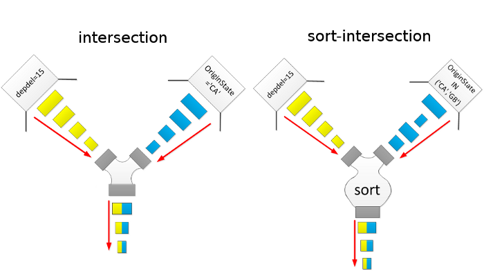

# TEST

# Disable index_merge on MySQL

## Index Merge


* 두 개 인덱스를 읽어내려가면서 병합하는 방식
* default: on


## Known bug
* Bug #79675  index_merge_intersection optimization causes wrong query results
  - 참조 : https://bugs.mysql.com/bug.php?id=79675

  
### Reproduce bug

### Reproduce schema

```sql
CREATE TABLE `table1` (
  `ID` bigint(20) NOT NULL,
  PRIMARY KEY (`ID`)
) ENGINE=InnoDB;

CREATE TABLE `table2` (
  `ID` bigint(20) NOT NULL,
  `c1` bigint(20) DEFAULT NULL,
  `c2` bigint(20) NOT NULL,
  PRIMARY KEY (`ID`),
  KEY `c1_INDEX` (`c1`),
  KEY `c2_INDEX` (`c2`)
) ENGINE=InnoDB;

insert into table1 values (1),(2);
insert into table2 values (1,1,20),(2,1,20),(3,1,30),(4,2,20),(5,2,20),(6,2,30);
```

### Test query

```sql
select * from table1 t1 where t1.ID=1 and exists (select 1 from table2 t2 where t2.c2=30 and t2.c1=t1.ID);
```

> Correct output would be ID=1

### index_merge

```sql
root@localhost:test 14:42:35>SET optimizer_switch="index_merge_intersection=on";
Query OK, 0 rows affected (0.00 sec)

root@localhost:test 14:42:40>explain select * from table1 t1 where t1.ID=1 and exists (select 1 from table2 t2 where t2.c2=30 and t2.c1=t1.ID);
+----+--------------------+-------+------------+-------------+-------------------+-------------------+---------+-------+------+----------+--------------------------------------------------------------+
| id | select_type        | table | partitions | type        | possible_keys     | key               | key_len | ref   | rows | filtered | Extra                                                        |
+----+--------------------+-------+------------+-------------+-------------------+-------------------+---------+-------+------+----------+--------------------------------------------------------------+
|  1 | PRIMARY            | t1    | NULL       | const       | PRIMARY           | PRIMARY           | 8       | const |    1 |   100.00 | Using index                                                  |
|  2 | DEPENDENT SUBQUERY | t2    | NULL       | index_merge | c1_INDEX,c2_INDEX | c2_INDEX,c1_INDEX | 8,9     | NULL  |    1 |   100.00 | Using intersect(c2_INDEX,c1_INDEX); Using where; Using index |
+----+--------------------+-------+------------+-------------+-------------------+-------------------+---------+-------+------+----------+--------------------------------------------------------------+
2 rows in set, 2 warnings (0.00 sec)

Note (Code 1276): Field or reference 'test.t1.ID' of SELECT #2 was resolved in SELECT #1
Note (Code 1003): /* select#1 */ select '1' AS `ID` from `test`.`table1` `t1` where (exists(/* select#2 */ select 1 from `test`.`table2` `t2` where ((`test`.`t2`.`c1` = '1') and (`test`.`t2`.`c2` = 30))))
root@localhost:test 14:42:42>select * from table1 t1 where t1.ID=1 and exists (select 1 from table2 t2 where t2.c2=30 and t2.c1=t1.ID);
Empty set (0.00 sec)
```
> Empty? Incorrect result.

### index scan

```sql
root@localhost:test 14:42:20>SET optimizer_switch="index_merge_intersection=off";
Query OK, 0 rows affected (0.00 sec)

root@localhost:test 14:42:26>explain select * from table1 t1 where t1.ID=1 and exists (select 1 from table2 t2 where t2.c2=30 and t2.c1=t1.ID);
+----+--------------------+-------+------------+-------+-------------------+----------+---------+-------+------+----------+-------------+
| id | select_type        | table | partitions | type  | possible_keys     | key      | key_len | ref   | rows | filtered | Extra       |
+----+--------------------+-------+------------+-------+-------------------+----------+---------+-------+------+----------+-------------+
|  1 | PRIMARY            | t1    | NULL       | const | PRIMARY           | PRIMARY  | 8       | const |    1 |   100.00 | Using index |
|  2 | DEPENDENT SUBQUERY | t2    | NULL       | ref   | c1_INDEX,c2_INDEX | c2_INDEX | 8       | const |    2 |    50.00 | Using where |
+----+--------------------+-------+------------+-------+-------------------+----------+---------+-------+------+----------+-------------+
2 rows in set, 2 warnings (0.00 sec)

Note (Code 1276): Field or reference 'test.t1.ID' of SELECT #2 was resolved in SELECT #1
Note (Code 1003): /* select#1 */ select '1' AS `ID` from `test`.`table1` `t1` where (exists(/* select#2 */ select 1 from `test`.`table2` `t2` where ((`test`.`t2`.`c1` = '1') and (`test`.`t2`.`c2` = 30))))

root@localhost:test 14:42:25>select * from table1 t1 where t1.ID=1 and exists (select 1 from table2 t2 where t2.c2=30 and t2.c1=t1.ID);
+----+
| ID |
+----+
|  1 |
+----+
1 row in set (0.00 sec)

```

### index_merge vs composite_index

```sql
root@localhost:test 14:54:59>alter table table2 add index c1_c2_index(c1, c2);
Query OK, 0 rows affected (0.02 sec)
Records: 0  Duplicates: 0  Warnings: 0

root@localhost:test 14:55:17>SET optimizer_switch="index_merge_intersection=on";
Query OK, 0 rows affected (0.00 sec)

root@localhost:test 14:55:23>explain select * from table1 t1 where t1.ID=1 and exists (select 1 from table2 t2 where t2.c2=30 and t2.c1=t1.ID);
+----+--------------------+-------+------------+-------+-------------------------------+-------------+---------+-------------+------+----------+-------------+
| id | select_type        | table | partitions | type  | possible_keys                 | key         | key_len | ref         | rows | filtered | Extra       |
+----+--------------------+-------+------------+-------+-------------------------------+-------------+---------+-------------+------+----------+-------------+
|  1 | PRIMARY            | t1    | NULL       | const | PRIMARY                       | PRIMARY     | 8       | const       |    1 |   100.00 | Using index |
|  2 | DEPENDENT SUBQUERY | t2    | NULL       | ref   | c1_INDEX,c2_INDEX,c1_c2_index | c1_c2_index | 17      | const,const |    1 |   100.00 | Using index |
+----+--------------------+-------+------------+-------+-------------------------------+-------------+---------+-------------+------+----------+-------------+
2 rows in set, 2 warnings (0.00 sec)

Note (Code 1276): Field or reference 'test.t1.ID' of SELECT #2 was resolved in SELECT #1
Note (Code 1003): /* select#1 */ select '1' AS `ID` from `test`.`table1` `t1` where (exists(/* select#2 */ select 1 from `test`.`table2` `t2` where ((`test`.`t2`.`c1` = '1') and (`test`.`t2`.`c2` = 30))))

root@localhost:test 14:55:51>select * from table1 t1 where t1.ID=1 and exists (select 1 from table2 t2 where t2.c2=30 and t2.c1=t1.ID);
+----+
| ID |
+----+
|  1 |
+----+
1 row in set (0.01 sec)
```  

## Performance
* 사용할만한 composite index 가 있음에도 불구하고, index_merge 로 실행계획이 풀린 경우가 있었다. 
- index_merge : 300초 이상
- index range scan : 42초


## Disable index_merge!
* 잘못된 결과값을 낼수 있기때문에 아예 이 방식으로 계획이 풀리지 않게 하고 싶다.
* my.cnf

```bash
vi my.cnf
optimizer_switch=index_merge_intersection=off

```

* set global variable 

```sql
SET global optimizer_switch = 'index_merge_intersection=off'
```
